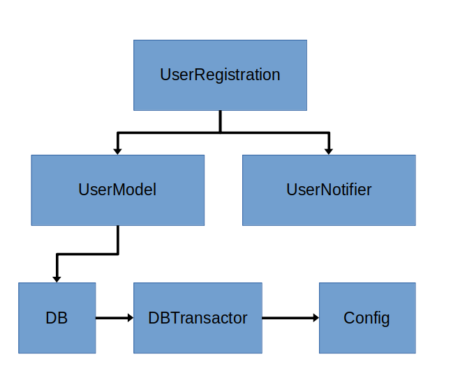

# Managing Dependencies using ZIO 2

A toy application, that shows how to manage dependencies using ZIO 2. Loosely based on [this blogpost](https://blog.softwaremill.com/managing-dependencies-using-zio-8acc1539e276) that does the same for ZIO.

## Dependency Diagram
This application models a simple user registration service that has the following components/dependencies: -



## Run application
Backend database is H2 in memory (connection parameters set in [application.properties](src/main/resources/application.properties)

```shell
sbt run
```

